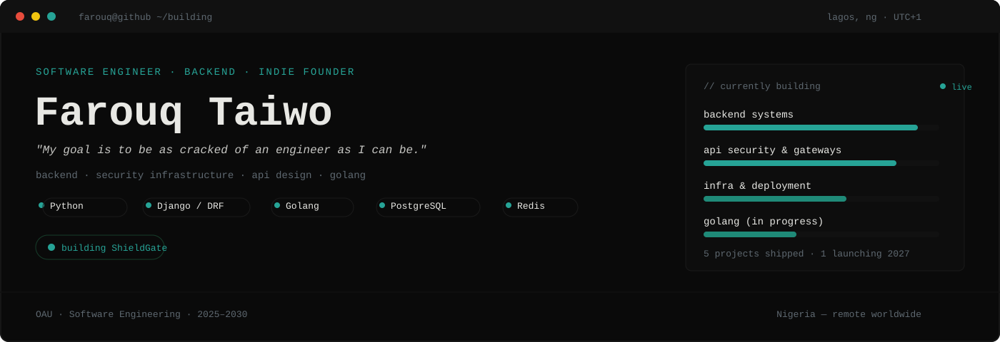
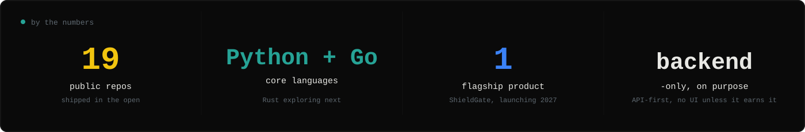

  

 

---

### whoami

I'm a backend engineer, self-taught into it while studying Software Engineering at Obafemi Awolowo University. I build clean APIs and infrastructure that holds up under real conditions — not demos, things meant to stay live.

Right now I'm building **[ShieldGate](https://shieldgateio.vercel.app)** — an API gateway and security-as-a-service platform. Most tools in that space are priced and built for teams with a dedicated DevOps engineer and a USD budget. ShieldGate is built for the developers left out of that assumption — five-minute SDK integration, Naira billing from day one, real threat protection on the free tier.

Backend first. Learning Go next, alongside the Python/Django stack I already ship with.

### currently

- 🛡️ Building **[ShieldGate](https://shieldgateio.vercel.app)** — API security infrastructure, launching June 2027
- 📚 Software Engineering @ OAU, Nigeria
- 🌍 Building fully in public — [follow along on X](https://x.com/shieldgateio)

---

### What I build with

**Languages**

**Backend and data**

**Infra and payments**

---

### By the numbers

  

---

### Talk to me

Building something backend-heavy, or want to compare notes on API security infrastructure? I'm reachable — [X](https://x.com/oluwa_koredeh) is fastest, [email](mailto:farouqtaiwo54@gmail.com) works too.

If it's about **ShieldGate** specifically: [shieldgateio.vercel.app](https://shieldgateio.vercel.app) · [@shieldgateio](https://x.com/shieldgateio)

---

<i>"My goal is to be as cracked of an engineer as I can be."</i>
 
EOF — © 2026 Farouq Taiwo

